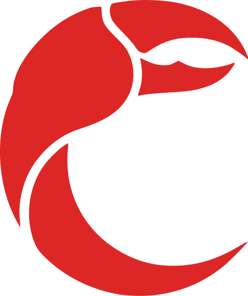

<p align="center">
  
</p>

# NakedClaw

**Your own personal AI assistant. AI that rewrites itself.**

NakedClaw is a self-improving AI agent that runs as a background daemon on your machine. Chat with it from your terminal, WhatsApp, Telegram, or Slack — and it can edit its own source code to add features, fix bugs, and grow.

## Quick start

```bash
bun install
bun link

nakedclaw setup     # authenticate with Anthropic
nakedclaw start     # start the daemon
nakedclaw           # chat
```

## Auth

NakedClaw supports two authentication methods:

- **Setup token** (recommended) — run `claude setup-token` in another terminal and paste the result
- **API key** — paste your `sk-ant-api03-...` key directly

## CLI

```
nakedclaw              chat with the agent
nakedclaw setup        authenticate with Anthropic
nakedclaw start        start the background daemon
nakedclaw stop         stop the daemon
nakedclaw restart      restart the daemon
nakedclaw status       show daemon status
nakedclaw logs         tail daemon logs
nakedclaw help         show help
```

## Channels

Enable channels in `nakedclaw.json5`:

- **Terminal** — built-in, always available via `nakedclaw`
- **WhatsApp** — scan QR code on first launch (check `nakedclaw logs`)
- **Telegram** — set `TELEGRAM_BOT_TOKEN` env var
- **Slack** — set `SLACK_BOT_TOKEN` + `SLACK_APP_TOKEN` env vars

## Features

- **Memory** — all chats saved as markdown in `memory/`, searchable, with `memory.md` loaded every session
- **Heartbeat** — configurable cron that triggers the agent periodically
- **Scheduler** — natural language scheduling ("remind me at 10", "every day at 9am")
- **Multiple terminals** — open as many `nakedclaw` sessions as you want
- **Config hot-reload** — edit `nakedclaw.json5` and heartbeat/scheduler update automatically

## Architecture

```
~/.nakedclaw/           state directory
  credentials.json      auth credentials
  daemon.pid            PID file
  daemon.sock           Unix socket (daemon <-> CLI)
  logs/daemon.log       daemon logs

nakedclaw.json5         project config
sessions/               JSONL transcripts per sender
memory/                 markdown chat history + memory.md index
```

Daemon runs in background. CLI clients connect via Unix socket using NDJSON protocol. Multiple terminals supported simultaneously.
