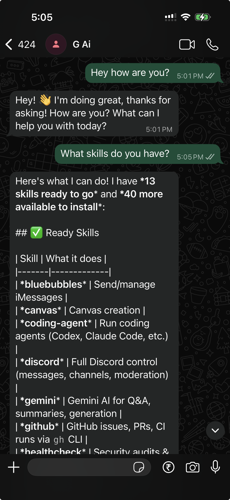
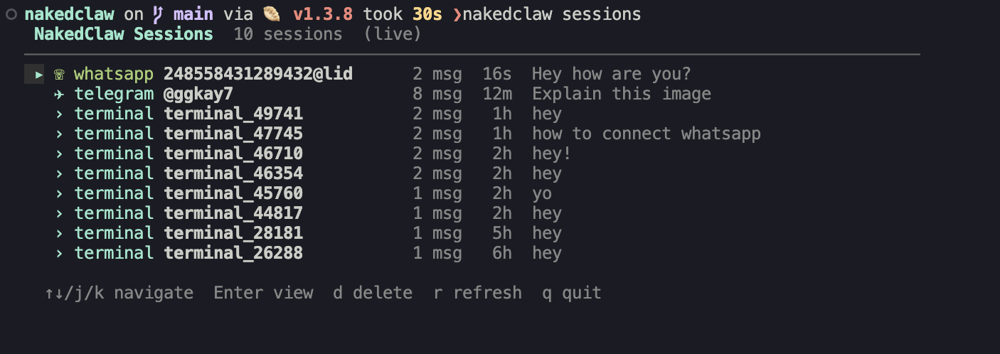

<p align="center">
  
</p>

# NakedClaw

**Your own personal AI assistant. AI that rewrites itself.**

NakedClaw is a self-improving AI agent that runs as a background daemon on your machine. Chat with it from your terminal, WhatsApp, Telegram, or Slack — and it can edit its own source code to add features, fix bugs, and grow.

<p align="center">
  <br/>
Nakedclaw in Whatsapp
</p>

## Why NakedClaw?

[OpenClaw](https://github.com/openclaw/openclaw) is great, but it's wearing a lot of clothes:

- A **macOS app** (204 Swift files, code signing, notarization, DMG packaging)
- An **iOS app** (28 Swift files, Xcode provisioning)
- An **Android app** (63 Kotlin files, Gradle build)
- A **web dashboard** (113 files, Lit components, Vite, Playwright)
- **127 npm dependencies** including sharp, pdfjs, playwright, AWS Bedrock SDK
- **617 documentation files** + a full Chinese translation pipeline
- **7 CI/CD workflows**, Docker images, 50+ release scripts
- **451,926 lines of code** across 2,581 files

NakedClaw strips all of that away. No Mac app. No web server. No mobile apps. No 32 channel plugins. No Docker. No CI. Just a daemon, a CLI, and two messaging channels. ~3,000 lines of TypeScript.

All the good functionality. None of the clothes. Truly naked.

## Features

- **Memory** — all chats saved as markdown in `memory/`, searchable, with `memory.md` loaded every session
- **Heartbeat** — configurable cron that triggers the agent periodically
- **Scheduler** — natural language scheduling ("remind me at 10", "every day at 9am")
- **Multiple terminals** — open as many `nakedclaw` sessions as you want
- **Config hot-reload** — edit `nakedclaw.json5` and heartbeat/scheduler update automatically
- **Skills** — NakedClaw reaches its long, naked claw into the [openclaw](https://github.com/openclaw/openclaw) skill catalog and shamelessly steals every single skill. 100% compatible with all openclaw skills — turns out you don't need clothes to be talented

<p align="center">
  <br/>
  Access it via the terminal
</p>

## Quick start

```bash
bun install
bun link

nakedclaw setup     # authenticate (Anthropic or OpenAI)
nakedclaw start     # start the daemon
nakedclaw           # chat
```

## Auth

NakedClaw supports multiple authentication methods:

**Anthropic:**
- **Setup token** (recommended) — run `claude setup-token` in another terminal and paste the result
- **API key** — paste your `sk-ant-api03-...` key directly

**OpenAI:**
- **API key** — paste your `sk-...` key
- **Codex** (ChatGPT subscription) — browser-based OAuth login, no API key needed

## CLI

```
nakedclaw              chat with the agent
nakedclaw setup        authenticate (Anthropic or OpenAI)
nakedclaw models       interactive model/provider picker
nakedclaw models set <provider>/<model>  set model directly
nakedclaw start        start the background daemon
nakedclaw stop         stop the daemon
nakedclaw restart      restart the daemon
nakedclaw status       show daemon status
nakedclaw logs         tail daemon logs
nakedclaw sessions     interactive session browser (live TUI)

nakedclaw skills       list skills with eligibility
nakedclaw skills sync  fetch skill catalog from GitHub
nakedclaw skills install <name>  install a skill's deps
nakedclaw skills info <name>     show skill details
nakedclaw help         show help
```

<p align="center">
  <br/>
  Manage and view sessions in terminal
</p>

## Channels

**Terminal** is always available — just run `nakedclaw`. For messaging channels, use the connect wizard:

### WhatsApp

```bash
nakedclaw connect wa
```

Walks you through it — enables WhatsApp in config, shows a QR code, you scan it, done. Auth is saved in `.wa-auth/` so you only scan once. Reconnects automatically.

### Telegram

```bash
nakedclaw connect tg
```

Prompts for your bot token (get one from [@BotFather](https://t.me/BotFather) — send `/newbot`). Verifies the token, enables Telegram in config, and offers to save the token to `.env`. Then just `nakedclaw restart`.

### Slack

```bash
nakedclaw connect slack
```

Prompts for your Bot Token (`xoxb-...`) and App Token (`xapp-...`). To get these:

1. Create an app at [api.slack.com/apps](https://api.slack.com/apps)
2. Enable **Socket Mode** (gives you the `xapp-` token)
3. Add Bot Token Scopes: `chat:write`, `app_mentions:read`, `im:history`, `im:read`, `im:write`
4. Install to workspace (gives you the `xoxb-` token)

The wizard verifies both tokens, enables Slack in config, and saves to `.env`.

### Access control

Each channel has an `allowFrom` list in `nakedclaw.json5`. Leave it empty to allow everyone, or restrict:

```json5
"telegram": { "enabled": true, "allowFrom": ["@yourusername"] }
"whatsapp": { "enabled": true, "allowFrom": ["+1234567890"] }
```

## Architecture

```
~/.nakedclaw/           state directory
  credentials.json      auth credentials
  daemon.pid            PID file
  daemon.sock           Unix socket (daemon <-> CLI)
  logs/daemon.log       daemon logs

nakedclaw.json5         project config
skills/                 stolen openclaw skills (cached locally)
sessions/               JSONL transcripts per sender
memory/                 markdown chat history + memory.md index
```

Daemon runs in background. CLI clients connect via Unix socket using NDJSON protocol. Multiple terminals supported simultaneously.
